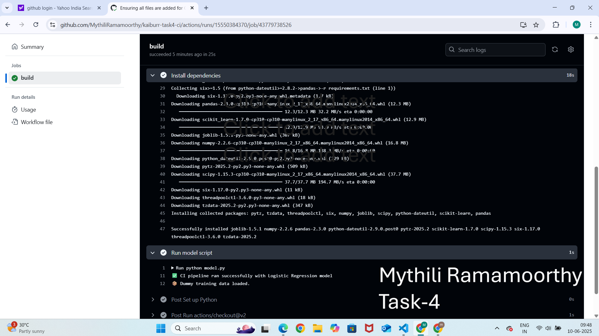

# Kaiburr Task 4 – CI for Python ML Model using GitHub Actions

This project implements **Continuous Integration (CI)** for a simple Machine Learning model using GitHub Actions. The pipeline runs automatically when code is pushed to the `main` branch.

---

## Project Structure

kaiburr-task4-ci/
├── .github/
│ └── workflows/
│ └── ci.yml # GitHub Actions workflow
├── model.py # Python script with dummy ML logic
├── requirements.txt # Required Python packages
└── README.md # Project documentation

---

## Technologies Used

- Python 3.10
- scikit-learn
- pandas
- Git & GitHub
- GitHub Actions (CI)

---

## setup Instructions

1. **Clone the repo**:
   ```bash
   git clone https://github.com/MythiliRamamoorthy/kaiburr-task4-ci.git
   ---

   cd kaiburr-task4-ci
   ✅ CI pipeline ran successfully with Logistic Regression model
   🍩 Dummy training data loaded.

   ---

## Workflow Screenshots

### Model Output in Log



